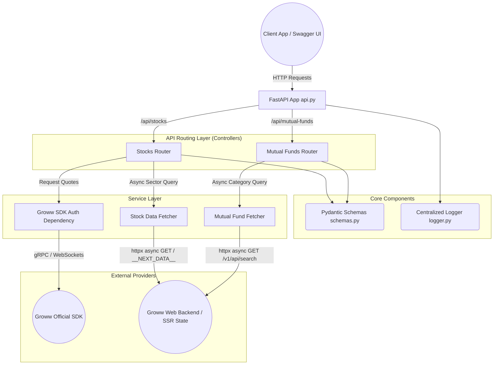
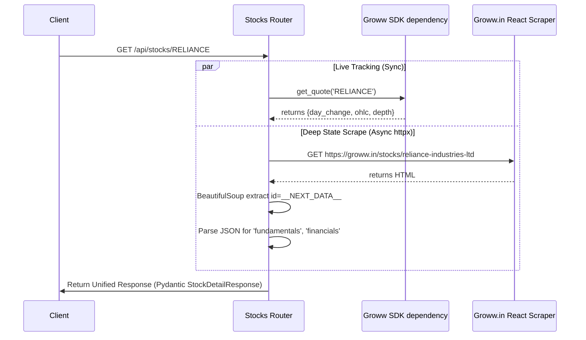

# Groww Data API Architecture

The application is structured as a modernized Fast-API application combining static data scraping with dynamic SDK quote retrieval. 

## High Level System Architecture

## Data Flow for Rich Quotes

Because official APIs only provide shallow data (like `live_quote`), the system unifies data from two sources on individual ID queries:

